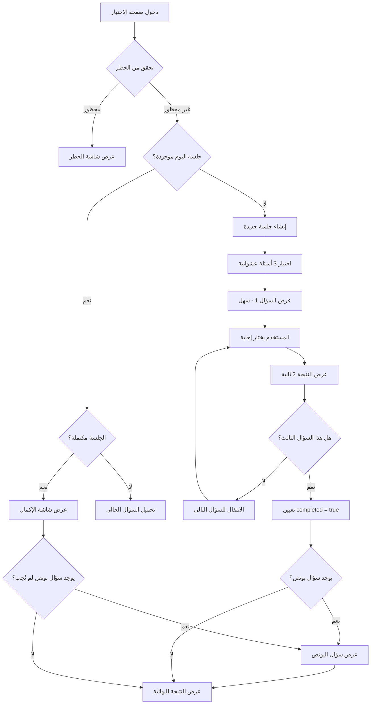

# ملخص نظام الاختبار - التحقق النهائي

## ✅ التحقق من الأتمتة الكاملة

### 1. نظام المحاولة الواحدة يومياً ✅
**الآلية:**
- يتم التحقق من وجود `daily_session` لليوم الحالي عند دخول صفحة الاختبار
- إذا وُجدت جلسة مكتملة (`completed: true`)، يُعرض ملخص النتائج فقط
- لا يمكن إنشاء جلسة جديدة إذا كانت هناك جلسة لنفس اليوم (قيد `UNIQUE(user_id, session_date)`)

**الكود المسؤول:**
```typescript
// السطر 83-91: التحقق من الجلسة اليومية
const today = new Date().toISOString().split('T')[0]
const { data: existingSession } = await supabase
    .from('daily_sessions')
    .select('*')
    .eq('user_id', user.id)
    .eq('session_date', today)
    .single()
```

### 2. اختيار 3 أسئلة عشوائية ✅
**الآلية:**
- يتم اختيار سؤال واحد من كل مستوى (سهل، متوسط، صعب)
- الأسئلة عشوائية من بين 10 أسئلة متاحة لكل مستوى
- يتم استبعاد الأسئلة التي أجاب عليها المستخدم سابقاً

**الكود المسؤول:**
```typescript
// السطر 124-178: إنشاء جلسة جديدة
for (const diff of difficulties) {
    const { data: questions } = await supabase
        .from('questions')
        .select('*')
        .eq('difficulty', diff)
        .eq('is_bonus', false)
        .not('id', 'in', `(${answeredIds.join(',') || 'null'})`)
        .limit(10)
    
    const randomIndex = Math.floor(Math.random() * questions.length)
    selectedQuestions.push(questions[randomIndex])
}
```

### 3. منع التحديث للحصول على أسئلة جديدة ✅
**الآلية:**
- الأسئلة محفوظة في `daily_sessions.question_ids` عند إنشاء الجلسة
- عند تحديث الصفحة، يتم تحميل نفس الأسئلة من الجلسة الموجودة
- لا يتم إنشاء أسئلة جديدة إلا في اليوم التالي

**الكود المسؤول:**
```typescript
// السطر 93-115: تحميل الجلسة الموجودة
if (existingSession) {
    setSession(existingSession)
    // تحميل السؤال الحالي من question_ids المحفوظة
    const questionId = existingSession.question_ids[existingSession.current_question_index]
    await loadQuestion(questionId)
}
```

### 4. تتبع التقدم ✅
**الآلية:**
- `current_question_index`: يتتبع السؤال الحالي (0، 1، 2)
- `user_answers`: يحفظ كل إجابة مع النتيجة
- `total_score`: يتم تحديثه بعد كل إجابة
- `completed`: يتم تعيينه إلى `true` بعد السؤال الثالث

**الكود المسؤول:**
```typescript
// السطر 233-245: تحديث الجلسة بعد كل إجابة
const nextIndex = session.current_question_index + 1
const isCompleted = nextIndex >= 3

await supabase
    .from('daily_sessions')
    .update({
        current_question_index: nextIndex,
        total_score: newTotalScore,
        completed: isCompleted
    })
    .eq('id', session.id)
```

## 🎨 حالات الواجهة (UI States)

### 1. حالة التحميل ⏳
**متى:** عند تحميل الصفحة لأول مرة
```typescript
if (loading) {
    return <Loader2 className="animate-spin" />
}
```

### 2. حالة الحظر 🚫
**متى:** إذا كان المستخدم محظوراً (`is_banned: true`)
```typescript
if (isBanned) {
    return (
        <div>
            <h1>تم حظر حسابك</h1>
            <p>للأسف، تم حظر حسابك من قبل الإدارة</p>
        </div>
    )
}
```

### 3. حالة الاختبار النشط 📝
**متى:** عند الإجابة على الأسئلة (0-2)
**المكونات:**
- شريط التقدم: 3 دوائر (مكتمل ✅، حالي 🟡، قادم ⚪)
- مستوى الصعوبة: شارة ملونة (سهل 🟢، متوسط 🟡، صعب 🔴)
- عداد الأسئلة: "السؤال 1 من 3"
- الخيارات: 4 أزرار قابلة للنقر
- رسالة تحفيزية: "السؤال القادم متوسط قليلاً، هل أنت مستعد؟"

### 4. حالة عرض النتيجة ✅❌
**متى:** بعد الإجابة على كل سؤال (2 ثانية)
**المكونات:**
- إجابة صحيحة: ✅ أخضر + "إجابة صحيحة! 🎉" + النقاط
- إجابة خاطئة: ❌ أحمر + "للأسف، إجابة خاطئة" + الإجابة الصحيحة

### 5. حالة الإكمال 🎉
**متى:** بعد الإجابة على الأسئلة الثلاثة
**المكونات:**
- عنوان: "أحسنت! 🎉"
- التاريخ: التاريخ الهجري الكامل
- النقاط الكلية: رقم كبير (من 30)
- ملخص الإجابات: 3 دوائر مع النقاط لكل سؤال
- نتيجة: "نتيجتك: X من 3 إجابات صحيحة"
- رسالة: "⏰ تحدي جديد غداً!"
- أزرار: لوحة المتصدرين + العودة

### 6. حالة سؤال البونص 🎁
**متى:** بعد الإكمال إذا كان هناك سؤال بونص لليوم
**المكونات:**
- رأس ذهبي: "🎁 سؤال بونص!"
- وصف: "فرصة للحصول على 20 نقطة إضافية!"
- نفس آلية السؤال العادي

### 7. حالة عدم وجود أسئلة ⚠️
**متى:** إذا لم يكن هناك أسئلة كافية في البنك
```typescript
if (selectedQuestions.length < 3) {
    alert('عذراً، لا توجد أسئلة كافية في البنك!')
}
```

## 📊 نظام النقاط

| المستوى | النقاط |
|---------|--------|
| سهل     | 5      |
| متوسط   | 10     |
| صعب     | 15     |
| بونص    | 20     |

**الحد الأقصى اليومي:**
- بدون بونص: 30 نقطة
- مع بونص: 50 نقطة

## 🔄 تدفق العمل الكامل



## ✅ النتيجة النهائية

**النظام مُؤتمت بالكامل ✅**

1. ✅ محاولة واحدة يومياً (قيد قاعدة البيانات + منطق التطبيق)
2. ✅ 3 أسئلة عشوائية (سهل، متوسط، صعب)
3. ✅ منع التحديث للحصول على أسئلة جديدة
4. ✅ تتبع التقدم بدقة
5. ✅ أسئلة بونص في أيام محددة
6. ✅ واجهة واضحة لجميع الحالات
7. ✅ رسائل تحفيزية
8. ✅ حماية من الغش
9. ✅ تحديث لوحة المتصدرين تلقائياً
10. ✅ تتبع نشاط المستخدم

**لا يوجد أي تدخل يدوي مطلوب - كل شيء آلي! 🚀**
